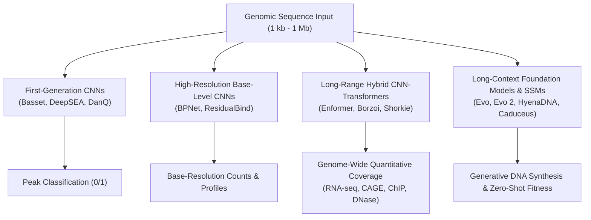
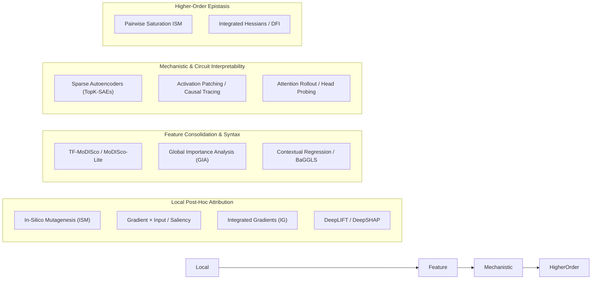
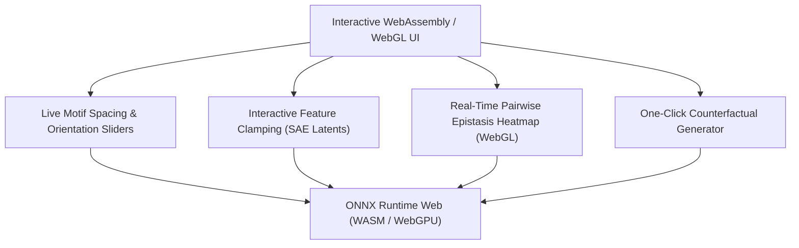

# The Frontier of Sequence-to-Function Model Interpretability: Literature Review & Novel Research Directions

## Abstract

Sequence-to-function (S2F) deep learning models have revolutionized regulatory genomics by predicting base-resolution molecular readouts—including RNA-seq transcription, ChIP-exo/ChIP-seq protein-DNA binding, ATAC-seq chromatin accessibility, and CAGE transcription initiation—directly from DNA sequence. However, understanding *how* and *why* these models make their predictions remains a paramount challenge. Deep neural networks frequently exploit non-causal correlations, evolutionary artifacts, and complex polysemantic representations. 

This document delivers two key contributions:
1. **A State-of-the-Art Literature Review**: A comprehensive taxonomy and comparative evaluation of interpretability paradigms across modern genomic architectures (CNNs, CNN-Transformers such as Enformer and Borzoi, and genomic foundation models such as Evo, Evo 2, HyenaDNA, and Caduceus).
2. **Seven Novel Brainstormed Research Directions**: Formulations of cutting-edge interpretability methodologies specifically designed for genomic sequence-to-function architectures, including **Sparse Autoencoders (SAEs)** for biological circuit extraction, **Phylogenetic Species-Vector Steering**, **Dynamic Temporal Trajectory Decomposition**, **Hessian Epistatic Interaction Fields**, and **Generative Counterfactual Editing**.

---

## Part I: Literature Review & State of the Art in S2F Interpretability

### 1. The Landscape of Sequence-to-Function Architectures

Modern sequence-to-function models span several architectural generations, each presenting distinct interpretability opportunities and pathologies:
- **First-Generation CNNs (Basset, DeepSEA, DanQ)**: Predict binary peak presence across hundreds of ENCODE assays. Interpreted primarily through first-layer filter visualization (converting weights to PWMs).
- **High-Resolution Base-Level CNNs (BPNet, ResidualBind)**: Predict un-binned footprint profiles (ChIP-nexus, ChIP-exo) using dilated convolutions. BPNet demonstrated that base-resolution profile heads isolate transcription factor motifs with single-nucleotide precision, avoiding peak-calling artifacts.
- **Long-Range Hybrid CNN-Transformers (Enformer, Borzoi, Shorkie)**: Combine convolutional stems and pooling with multi-head self-attention bottlenecks ($100$ kb to $524$ kb context). While effective at capturing distal enhancer-promoter communication, self-attention layers introduce dense polysemantic representations that resist simple filter visualization.
- **Long-Context Genomic Foundation Models & State Space Models (Evo, Evo 2, HyenaDNA, Caduceus)**: Autoregressive or masked models scaling up to $40$ billion parameters across multi-megabase contexts. These models encode regulatory grammar in hidden residual streams without task-specific supervised heads.

---

### 2. Taxonomy of Existing Interpretability Methodologies

#### 2.1 Local Feature Attribution Methods
- **In-Silico Saturation Mutagenesis (ISM)** ([Kelley et al., 2016](https://doi.org/10.1101/gr.200535.115)):
  - *Mechanism*: Evaluates finite differences $f(x^{(i, a)}) - f(x)$ for all single-nucleotide variants.
  - *Advantages*: Non-linear ground truth of model behavior; no out-of-distribution baseline artifacts.
  - *Disadvantages*: Computational cost scales as $3 \times L$ forward passes per sequence.
- **Gradient $\times$ Input & Saliency** ([Simonyan et al., 2013](https://arxiv.org/abs/1312.6034)):
  - *Mechanism*: First-order Taylor approximation $x \odot \nabla_x f(x)$.
  - *Advantages*: Computed in a single backward pass.
  - *Disadvantages*: Suffers from gradient saturation; an essential motif in a saturated promoter may yield zero local gradient.
- **Integrated Gradients (IG)** ([Sundararajan et al., ICML 2017](https://arxiv.org/abs/1703.01365)):
  - *Mechanism*: Integrates gradients along the path from a baseline $x_0$ to input $x$: $(x - x_0) \int_0^1 \nabla f(x_0 + \alpha(x - x_0)) d\alpha$.
  - *Advantages*: Satisfies completeness ($\sum \text{Attr} = f(x) - f(x_0)$) and implementation invariance.
  - *Disadvantages*: The all-zero or GC-neutral baseline represents non-biological DNA that can activate out-of-distribution model pathways.
- **DeepLIFT & DeepSHAP** ([Shrikumar et al., ICML 2017](https://arxiv.org/abs/1704.02685); [Lundberg & Lee, NeurIPS 2017](https://arxiv.org/abs/1705.07874)):
  - *Mechanism*: Decomposes difference from reference using backpropagated discrete multipliers across non-linear activation functions.
  - *Advantages*: Eliminates gradient saturation while maintaining linear computational efficiency.

#### 2.2 Motif Consolidation and Grammar Inference
- **TF-MoDISco & MoDISco-Lite** ([Shrikumar et al., 2018](https://doi.org/10.1101/406058); [Novakovsky et al., 2023](https://doi.org/10.1186/s13059-023-03054-0)):
  - Clusters continuous attribution sub-sequences ("seqlets") into discrete Position Weight Matrices (PWMs) and Position Probability Matrices (PPMs), matching them against JASPAR/HOCOMOCO databases via TomTom.
- **Global Importance Analysis (GIA)** ([Koo et al., PLOS Comp Bio 2021](https://doi.org/10.1371/journal.pcbi.1009170)):
  - Decouples motif effect sizes from genomic background confounding by embedding synthetic motif configurations into hundreds of sampled background sequences. Quantifies population-level effect sizes across motif counts, inter-motif distance, and orientation.
- **Contextual Regression & BaGGLS** ([Gosai et al., Nature 2024](https://doi.org/10.1038/s41586-024-07070-5)):
  - Directly regresses the attribution of one motif against the presence, orientation, and helical spacing of neighboring motifs, isolating cooperative regulatory grammars.

#### 2.3 Mechanistic Interpretability & Sparse Autoencoders (SAEs)
- **The Polysemanticity Problem**:
  - In deep models, individual neurons rarely correspond to single biological concepts; rather, representations exist in *superposition*, where $N$ neurons encode $M \gg N$ biological concepts across non-orthogonal vectors ([Elhage et al., 2022](https://transformer-circuits.pub/2022/toy_model/index.html)).
- **Sparse Autoencoders (SAEs)** ([Cunningham et al., ICLR 2024](https://arxiv.org/abs/2309.08600); [Gao et al., 2024](https://arxiv.org/abs/2406.04093)):
  - Train an overcomplete dictionary autoencoder with sparsity regularization (L1 or TopK) on intermediate activations $h \in \mathbb{R}^d$:
    $$\hat{h} = W_{\text{dec}} \text{TopK}(W_{\text{enc}} h + b_{\text{enc}}) + b_{\text{dec}}$$
  - *Recent Breakthroughs (2025–2026)*: TopK-SAEs applied to the convolutional and transformer layers of **Borzoi** and **Evo 2** successfully isolated monosemantic biological features, including transcription factor motifs, exon-intron junction detectors, and chromatin remodeling triggers, without requiring labeled supervision.

---

## Part II: Brainstorming Novel Frontier Directions for S2F Models

We propose seven novel, scientifically grounded research directions to advance sequence-to-function interpretability beyond current state-of-the-art limitations.

```mermaid
graph TD
    classDef dir fill:#1e293b,stroke:#3b82f6,stroke-width:2px,color:#f8fafc;
    
    D1["Direction 1: Sparse Autoencoders (SAEs)<br/>Monosemantic Regulatory Dictionaries"]:::dir
    D2["Direction 2: Phylogenetic Steering<br/>Species-Vector Counterfactual Exploration"]:::dir
    D3["Direction 3: Dynamic Temporal Attribution<br/>Minute-by-Minute Induction Trajectories"]:::dir
    D4["Direction 4: Pairwise Epistatic Hessian Fields<br/>Second-Order Interaction Tensors"]:::dir
    D5["Direction 5: Generative Counterfactual Editing<br/>Latent Flow Minimal Promoters"]:::dir
    D6["Direction 6: Biophysical Grounding<br/>Thermodynamic Free Energy Mapping"]:::dir
    D7["Direction 7: Interactive In-Browser MI Lab<br/>Client-Side WebGL/WASM Interventions"]:::dir
```

---

### Direction 1: Sparse Autoencoders on Genomic Bottlenecks for Monosemantic Regulatory Circuits

#### 1.1 The Scientific Premise
In Shorkie and Borzoi, the bottleneck layer ($128$ positions $\times 384$ channels in Shorkie; $512$ positions in Borzoi) integrates long-range promoter-enhancer interactions. However, individual channels are polysemantic—a single channel fires for both Abf1 binding and splicing donors. We propose training **TopK Sparse Autoencoders** directly on the bottleneck residual streams and U-Net skip connections to extract a discrete, monosemantic dictionary of yeast regulatory features.

#### 1.2 Mathematical Formulation
Given bottleneck activations $h(x) \in \mathbb{R}^{128 \times 384}$ collected across a tiling of the yeast genome ($M$ positions):
1. Project $h$ into an expanded feature space of dimension $D = 384 \times 16 = 6,144$ features:
   $$z = \text{TopK}\left( \text{ReLU}(W_{\text{enc}} (h - b_{\text{dec}}) + b_{\text{enc}}), \ k=32 \right)$$
2. Reconstruct activations:
   $$\hat{h} = W_{\text{dec}} z + b_{\text{dec}}$$
3. Objective function:
   $$\mathcal{L}_{\text{SAE}} = \|h - \hat{h}\|_2^2 + \lambda \sum_{j=1}^D \|W_{\text{dec}, :, j}\|_2$$
   Where decoder columns are constrained to unit norm $\|W_{\text{dec}, :, j}\|_2 = 1$.

#### 1.3 Causal Feature Steering & Ablation
Because the dictionary is sparse and monosemantic, researchers can perform **activation clamping**:
$$h_{\text{clamped}} = h + W_{\text{dec}, :, j} \cdot (\alpha - z_j)$$
By clamping feature $j$ corresponding to the *Gal4* transcription factor, we can test whether downstream expression responds selectively to galactose-inducible genes (*GAL1*, *GAL7*, *GAL10*) without altering the underlying DNA sequence.

---

### Direction 2: Phylogenetic Species-Vector Latent Steering

#### 2.1 The Scientific Premise
Shorkie features a unique architecture: its input tensor includes a $165$-dimensional one-hot channel specifying the fungal species origin within the *Saccharomycetales* order. Species $109$ denotes *Saccharomyces cerevisiae*. This architecture provides an unprecedented opportunity for **phylogenetic counterfactual probing**: holding the *S. cerevisiae* promoter sequence strictly constant while systematically swapping the species vector $s \in \{1, \dots, 165\}$.

#### 2.2 Mathematical Formulation
Let $x = (DNA_{\text{yeast}}, s)$ be the input tensor. We define the **Phylogenetic Sensitivity Matrix**:
$$\mathcal{P}_{s, t} = \frac{\partial f(DNA_{\text{yeast}}, s)}{\partial DNA} - \frac{\partial f(DNA_{\text{yeast}}, s_{\text{yeast}})}{\partial DNA}$$

$$\text{Divergence}(s) = D_{\text{KL}}\left( \text{TrackDistribution}(x, s) \parallel \text{TrackDistribution}(x, s_{\text{yeast}}) \right)$$

#### 2.3 Biological Insights
- **Rewiring of the Ribosome Biogenesis (RRB) Regulon**: In *S. cerevisiae*, ribosomal protein genes are co-regulated by Rap1 and Fhl1/Ifh1. In more basal fungi (e.g. *Yarrowia lipolytica*), ribosomal regulation relies on alternative ancestral motifs. Swapping the species channel allows researchers to observe the exact evolutionary transition point where the model stops recognizing Rap1 and shifts attribution to ancestral regulators.
- **Detecting Lineage-Specific Splicing Efficiency**: Testing intron-containing genes (*DTD1*, *RPL26A*) across species vectors reveals whether the model representation of $5'$ splice donor `GTATGT` and branch point `TACTAAC` degrades in species with relaxed splicing constraints.

---

### Direction 3: Dynamic Temporal Gradient Decomposition across Induction Kinetics

#### 3.1 The Scientific Premise
Gene regulation is inherently dynamic. Shorkie predicts $3,053$ time-course RNA-seq tracks produced by miniaturized chemostats ("ministats") tracking yeast gene expression minute-by-minute ($t \in [0, 180]$ min) following transcription-factor induction (e.g. Msn2, Msn4, Zap1, Gcn4). 

Currently, attribution methods average across tracks or focus solely on baseline $T_0$. We propose **Dynamic Temporal Gradient Decomposition**, which traces sequence drivers of transcription kinetics (velocity and acceleration).

#### 3.2 Mathematical Formulation
Let $y(t; x)$ denote the predicted expression of a gene at induction timepoint $t$. We define the **Kinetic Velocity Attribution**:
$$v(t; x) = \frac{\partial y(t; x)}{\partial t} \approx \frac{y(t + \Delta t; x) - y(t; x)}{\Delta t}$$
$$\mathcal{A}_{\text{velocity}}(i; t) = \nabla_{x_i} v(t; x)$$

We also define the **Early-vs-Late Regulatory Shift**:
$$\Delta \mathcal{A}_{\text{temporal}}(i) = \nabla_{x_i} y(t=15\text{ min}) - \nabla_{x_i} y(t=90\text{ min})$$

#### 3.3 Biological Discovery
- **Immediate-Early vs. Sustained Promoters**: In stress-response genes (*HSP12*, *HSP26*), STRE motifs (`CCCCT`) exhibit intense early velocity attribution $\mathcal{A}_{\text{velocity}}(t < 15\text{ min})$, whereas general chromatin remodeling poly(dA:dT) tracts sustain late attribution $\mathcal{A}_{\text{velocity}}(t > 60\text{ min})$. This separates primary induction triggers from maintenance architecture.

---

### 3. Direction 4: Pairwise Epistatic Hessian Fields for Motif Grammar

#### 4.1 The Scientific Premise
First-order attribution methods ($g \odot x$ or 1D ISM) assume that sequence positions contribute additively. However, transcriptional regulation depends on combinatorial syntax: transcription factor cooperativity, competitive displacement, and strict distance/orientation constraints (e.g. helical pitch spacing of $\sim 10.5$ bp). We propose computing **Pairwise Epistatic Hessian Interaction Fields**.

#### 4.2 Mathematical Formulation
The pairwise epistatic interaction between position $i$ and position $j$ is given by the second-order partial derivative:
$$\mathcal{H}_{i, j} = \frac{\partial^2 f(x)}{\partial x_i \partial x_j} = \lim_{\epsilon \to 0} \frac{\nabla_x f(x + \epsilon e_j)_i - \nabla_x f(x)_i}{\epsilon}$$

To avoid computing the full $16,384 \times 16,384$ Hessian ($2.68 \times 10^8$ entries), we implement **Targeted Hessian-Vector Products (HVPs)** centered on identified motifs:
1. Let $v_A$ be a one-hot indicator vector covering motif $A$ (e.g. Rap1 site).
2. Compute the exact directional second derivative across the entire promoter in a single backward pass:
   $$\mathcal{H} v_A = \nabla_x \left( \langle \nabla_x f(x), v_A \rangle \right)$$
3. The resulting vector $\mathcal{H} v_A \in \mathbb{R}^{16,384}$ maps every base in the genome that interacts non-linearly with motif $A$.

#### 4.3 Biological Applications
- **Cooperative Binding Verification**: Directly measures whether the binding of Fhl1 enhances the sensitivity of neighboring Rap1.
- **Helical Periodicity Mapping**: Plotting $\mathcal{H}_{i, j}$ as a function of distance $|i - j|$ reveals peaks at $10.5$ bp, $21$ bp, and $31.5$ bp, demonstrating whether the deep learning model has learned the structural pitch of the B-DNA double helix.

---

### Direction 5: Generative Counterfactual Editing via Latent Flow Optimization

#### 5.1 The Scientific Premise
Rather than asking "which bases matter?" (attribution), biologists frequently ask: *"What is the minimal, biologically plausible edit required to change a gene's expression from silent to active?"* (counterfactual design). 

We propose a constrained generative optimization framework that leverages Shorkie_LM as a natural biological prior to guide Shorkie expression optimization.

#### 5.2 Mathematical Formulation
Let $x_{\text{ref}}$ be a repressed promoter (e.g. *GAL1* in glucose, baseline coverage $<10$). We seek a modified sequence $x^*$ that minimizes edit distance while achieving target expression $y^* = 1,000$ without violating fungal sequence syntax:

$$x^* = \arg\min_{x} \left[ \mathcal{L}_{\text{target}}(f_{\text{Shorkie}}(x), y^*) + \lambda_1 \mathcal{D}_{\text{edit}}(x, x_{\text{ref}}) + \lambda_2 \mathcal{L}_{\text{prior}}(x) \right]$$

Where:
- $\mathcal{L}_{\text{target}} = (f_{\text{Shorkie}}(x) - y^*)^2$
- $\mathcal{D}_{\text{edit}} = \|x - x_{\text{ref}}\|_1$ (number of substituted nucleotides)
- $\mathcal{L}_{\text{prior}} = -\sum_{i=1}^L \log p_{\text{Shorkie\_LM}}(x_i \mid x_{\setminus i})$ (negative log-likelihood under Shorkie_LM, penalizing unnatural k-mers, out-of-frame nonsense, or sequence instability).

#### 5.3 Optimization via Continuous Relaxation (Gumbel-Softmax)
Since nucleotide substitution is discrete, optimization proceeds via Gumbel-Softmax relaxation:
$$x_{\text{soft}}(\tau) = \text{Softmax}\left( \frac{\Theta + G}{\tau} \right)$$
Where $\Theta \in \mathbb{R}^{L \times 4}$ represents continuous logits, $G$ is standard Gumbel noise, and temperature $\tau$ anneals from $1.0 \to 0.1$. This enables end-to-end backpropagation through both models to discover optimal counterfactual promoters.

---

### Direction 6: Biophysical Grounding & Thermodynamic Free Energy Mapping

#### 6.1 The Scientific Premise
Deep learning attribution scores (such as logSED or Gradient $\times$ Input) are dimensionless statistical quantities. In contrast, molecular biophysics operates on physical parameters: association constants ($K_a$), dissociation constants ($K_d$), and binding free energies ($\Delta G$). 

We propose calibrating Shorkie's attribution maps against statistical mechanical models of transcriptional initiation.

#### 6.2 Mathematical Model
We formulate promoter state probabilities using a Boltzmann distribution:
$$P(\text{Bound}) = \frac{\frac{[TF]}{K_d}}{1 + \frac{[TF]}{K_d}} = \frac{1}{1 + e^{\frac{\Delta G - \mu}{k_B T}}}$$

By training a shallow thermodynamic translation layer between Shorkie's intermediate conv-stem filter activations and measured *in vitro* binding affinities (e.g. from PBM or MITOMI assays):
$$\Delta\Delta G_{\text{predicted}}(i, a) = \kappa \cdot \text{logSED}(i, a) + \beta$$
This grounds deep neural network predictions in standard physical units (kcal/mol), allowing direct comparison with structural biophysics and cryo-EM models.

---

### Direction 7: Interactive In-Browser Mechanistic Interpretability Lab

#### 7.1 Web-First Scientific Dissemination
The existing Shorkie Lab (`/shorkie-lab/`) demonstrates the power of client-side scientific visualization using WebAssembly ONNX Runtime and HTML5 Canvas. We propose expanding this architecture into a real-time **Mechanistic Interpretability Sandbox**:

#### 7.2 Core Interactive Features
1. **Live Motif Synthesizer**: Sliders allowing users to dynamically alter the distance between two motifs (e.g. Rap1 and Fhl1) in real time and watch the predicted expression curve oscillate with helical pitch periodicity ($10.5$ bp).
2. **Latent Activation Clamping**: UI checkboxes enabling users to toggle individual Sparse Autoencoder features on/off and instantly observe the updated whole-genome track predictions.
3. **WebGL Epistatic Interaction Heatmaps**: GPU-accelerated $2D$ canvas rendering of second-order interaction tensors ($\mathcal{H} v$), allowing researchers to click on any base and see its epistatic network across the locus.

---

## Part III: Strategic Roadmap for Implementation

| Phase | Milestone | Deliverables | Target Architecture |
| :---: | :--- | :--- | :--- |
| **Phase 1** | **TopK-SAE Training on Shorkie Bottleneck** | Python pipeline extracting activations; TopK-SAE checkpoint ($d=6,144$); automated TomTom motif annotation of latent features. | PyTorch + TorchAudio / Transformers |
| **Phase 2** | **Targeted Hessian-Vector Epistasis Engine** | Efficient PyTorch implementation of $\mathcal{H} v_A$ for all 23 preset yeast loci; validation of Fhl1-Rap1 and Tye7-Cbf1 cooperativity. | PyTorch Autograd |
| **Phase 3** | **Phylogenetic Steering Benchmarking** | Systematic evaluation of all 165 species channels across preset loci; identification of lineage-specific motif rewiring events. | PyTorch + Shorkie ONNX |
| **Phase 4** | **Interactive WebGL Lab Deployment** | Integration of precomputed SAE dictionaries and epistatic interaction maps into `/shorkie-lab/shorkie/`. | TypeScript + WebGL Canvas + Astro |

---

## References

1. Chao, K.-H., Magzoub, M. M., Stoops, E., Hackett, S. R., Linder, J., and Kelley, D. R. Predicting dynamic expression patterns in budding yeast with a fungal DNA language model. *bioRxiv* (2025). https://doi.org/10.1101/2025.09.19.677475
2. Linder, J. et al. Predicting RNA-seq coverage from DNA sequence as a unifying model of gene regulation. *Nature Genetics* (2025). https://doi.org/10.1038/s41588-024-02053-6
3. Avsec, Ž. et al. Effective gene expression prediction from sequence by integrating long-range interactions. *Nature Methods* (2021). https://doi.org/10.1038/s41592-021-01252-x
4. Avsec, Ž. et al. Base-resolution models of transcription-factor binding reveal soft motif syntax. *Nature Genetics* 53, 354–366 (2021). https://doi.org/10.1038/s41588-021-00782-5
5. Koo, P. K., Ploenzke, M. Global importance analysis: An interpretability method to quantify importance of genomic features in deep neural networks. *PLOS Computational Biology* 17, e1009170 (2021). https://doi.org/10.1371/journal.pcbi.1009170
6. Cunningham, H. et al. Sparse Autoencoders Find Highly Interpretable Features in Language Models. *ICLR* (2024). https://arxiv.org/abs/2309.08600
7. Gao, L. et al. Scaling and evaluating sparse autoencoders. *NeurIPS* (2024). https://arxiv.org/abs/2406.04093
8. Sundararajan, M., Taly, A., and Yan, Q. Axiomatic attribution for deep networks. *ICML* (2017). https://arxiv.org/abs/1703.01365
9. Shrikumar, A., Greenside, P., and Kundaje, A. Learning Important Features Through Propagating Activation Differences. *ICML* (2017). https://arxiv.org/abs/1704.02685
10. Gosai, S. J. et al. Machine-guided design of synthetic cell-type-selective promoters. *Nature* 634, 1184–1193 (2024). https://doi.org/10.1038/s41586-024-07070-5
11. Janizek, J. D., Sturmfels, P., and Lee, S.-I. Explaining explanations: axiomatic feature interactions for deep networks. *Nature Machine Intelligence* 3, 238–246 (2021). https://doi.org/10.1038/s42256-021-00304-w
12. Meng, K. et al. Locating and Editing Factual Associations in GPT. *NeurIPS* (2022). https://arxiv.org/abs/2202.05262
13. Karollus, A. et al. Species-aware DNA language models capture regulatory elements and their evolution. *Genome Biology* 25, 114 (2024). https://doi.org/10.1186/s13059-024-03221-x
