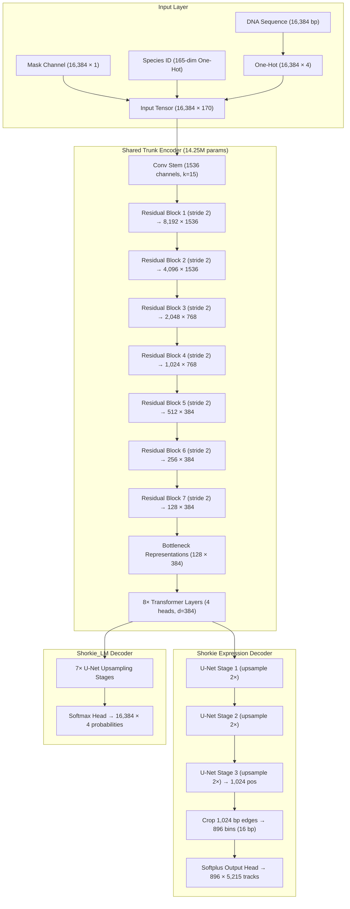

# Comprehensive Guide: Interpretability Methods in Shorkie and Shorkie_LM

## Executive Summary

The **Shorkie** suite ([Chao et al., bioRxiv 2025](https://doi.org/10.1101/2025.09.19.677475)) constitutes a multi-modal deep learning framework for reading, predicting, and interpreting regulatory genomics in budding yeast (*Saccharomyces cerevisiae*). It addresses a fundamental challenge in computational biology: natural genomes contain extensive non-functional correlations, evolutionary drift, and complex non-linear sequence dependencies. To separate learned regulatory grammar from shortcut features, Shorkie integrates two distinct model classes coupled with an extensive suite of attribution, perturbation, and representation-probing methods:

1. **Shorkie (Fine-Tuned Expression Model)**: A multi-task sequence-to-expression network predicting $5,215$ regulatory tracks (induction RNA-seq time courses, strain RNA-seq, ChIP-exo, histone modifications) from $16,384$ bp windows.
2. **Shorkie_LM (Self-Supervised Masked Language Model)**: An alignment-free sequence model pretrained across $165$ *Saccharomycetales* fungal genomes, providing zero-shot sequence constraint and reconstruction distributions.

This document details every interpretability method, mathematical formulation, computational complexity, and biological validation metric implemented across the two models in the codebase (`src/pages/shorkie-lab/shorkie.astro`, `src/pages/shorkie-lab/shorkie_lm.astro`, `src/scripts/variantPlayground.ts`, `src/scripts/shorkieLm.ts`, `scripts/shorkie/`).

---

## 1. Architectural Foundations & Data Flows

### 1.1 Model Topologies and Tensor Dimensions

### 1.2 Coordinate System & Cropping Invariants
- **Input Context**: $16,384$ bp.
- **Receptive Field**: Due to dilated residual convolutions and full self-attention at the bottleneck, the effective receptive field covers the entire window.
- **Expression Output Bins**: The central $14,336$ bp are tiled into $896$ non-overlapping bins of $16$ bp ($896 \times 16 = 14,336$ bp). The leftmost $1,024$ bp (bins $<0$) and rightmost $1,024$ bp (bins $\ge 896$) are cropped because edge bins lack bilateral convolutional context.
- **LM Output**: Decodes back to all $16,384$ base positions ($16,384 \times 4$).

---

## 2. Interpretability Methods for Shorkie Expression (`/shorkie-lab/shorkie/`)

### 2.1 The Scalar Differentiation Target: `logSED`
All gradient-based and perturbation-based methods evaluate the same scalar objective $f(x)$ representing the expression of a target region or gene:

$$f(x) = \log_2 \left( \sum_{b = \text{bin}_{\text{start}}}^{\text{bin}_{\text{end}}} \left( \frac{1}{|T_0|} \sum_{t \in T_0} y_{b, t}(x) \right) + 1 \right)$$

Where:
- $T_0$ is the curated set of $384$ uninduced baseline RNA-seq tracks (`_T0_`, track indices $1148$–$4200$).
- $b$ spans the bins intersecting the annotated target gene body.
- $+1$ is the pseudo-count preventing negative infinities and stabilizing low baselines.
- Differentiating $\log_2(S_{\text{alt}} + 1)$ directly yields the gradient of the log single-effect difference ($\text{logSED}$), ensuring consistency across all attribution methods.

---

### 2.2 Method 1: Full-Window In-Silico Saturation Mutagenesis (ISM)
In-silico saturation mutagenesis is the gold standard for sequence-to-function models. Rather than relying on local linear approximations, ISM physically mutates every base to all three alternate alleles and evaluates the model's non-linear response.

#### Mathematical Formulation
For each position $i \in \{1, \dots, 16384\}$ and alternate nucleotide $a \in \{A, C, G, T\} \setminus \{x_i^{\text{ref}}\}$:
1. Construct mutant sequence $x^{(i, a)}$ with base $a$ substituted at position $i$.
2. Compute forward predictions for forward strand $x$ and reverse-complement strand $\text{rc}(x)$:
   $$\text{logSED}_{\text{fwd}}(i, a) = f(x^{(i, a)}) - f(x^{\text{ref}})$$
   $$\text{logSED}_{\text{rev}}(i, a) = f(\text{rc}(x^{(i, a)})) - f(\text{rc}(x^{\text{ref}}))$$
3. Compute test-time reverse-complement averaged effect:
   $$\Delta(i, a) = \frac{1}{2} \left[ \text{logSED}_{\text{fwd}}(i, a) + \text{logSED}_{\text{rev}}(i, a) \right]$$
4. Apply Borzoi-style mean-centering across all 4 nucleotides:
   $$\bar{\Delta}(i) = \frac{1}{4} \sum_{b \in \{A, C, G, T\}} \Delta(i, b) \quad (\text{with } \Delta(i, x_i^{\text{ref}}) = 0)$$
   $$\text{Saliency}(i, b) = \Delta(i, b) - \bar{\Delta}(i)$$
5. Project onto reference nucleotide for sequence logo visualization:
   $$S_{\text{ISM}}(i) = \text{Saliency}(i, x_i^{\text{ref}}) = -\bar{\Delta}(i) = -\frac{1}{4} \sum_{a \ne x_i^{\text{ref}}} \Delta(i, a)$$

#### Computational Properties & Optimizations
- **Arithmetic Scale**: $16,384 \text{ positions} \times 3 \text{ substitutions} \times 2 \text{ strands} = 98,304$ forward passes per locus ($1,376,256$ forward passes across 14 loci).
- **Head Slicing Optimization**: Slicing the output head from $5,215$ channels down to the $384$ $T_0$ tracks prior to inference reduces linear arithmetic by $20\%$.
- **In-Place Batch Tensor Mutation**: Mutant inputs differ in only $4$ floating-point elements per batch. Mutating device buffers in-place avoids copying $356$ MB per batch.
- **Throughput**: On Apple Silicon (MPS) at batch size $32$, inference takes $10.47$ ms per forward pass ($23.8$ ms per substitution, $\sim 19.5$ min per full $16$ kb locus).

#### Key Biological Discoveries from Full-Window ISM
- **Regulatory Polarity Rule**: In $22$ of $23$ tested loci, the sign of the strongest single substitution strictly matches the gene's baseline transcription state:
  - **Repressed / Silent Genes** (*HOP2* [meiotic], *GAL1*, *GAL3* [glucose-repressed]): The largest substitutions **raise** predicted expression ($+1.38$, $+1.12$, $+0.78$ logSED). The model's primary lever is disrupting repressor binding sites.
  - **Actively Expressed Genes** (*TDH3*, *PDC1*, *POP4*): The largest substitutions **reduce** predicted expression (up to $-0.65$ logSED). The model's primary lever is breaking essential activator motifs.
  - **The Biological Exception**: *PWP1* is actively transcribed yet its strongest substitution is $+0.223$. Mechanistic inspection reveals *PWP1* is governed by the Ribosome Biogenesis (RRB) regulon and carries two active repressor motifs (PAC and RRPE). Breaking these repressors boosts expression further.

---

### 2.3 Method 2: Gradient $\times$ Input (Saliency)
Gradient $\times$ Input provides an instantaneous local linear sensitivity map via a single backpropagation pass.

#### Mathematical Formulation
1. Compute the backward gradient of the target scalar $f(x)$ with respect to the input tensor $x \in \mathbb{R}^{16384 \times 4}$:
   $$g_{\text{fwd}} = \nabla_x f(x)$$
2. Compute the gradient on the reverse-complement input, accounting for coordinate flipping and base swapping:
   $$g_{\text{rev}} = \nabla_{\text{rc}(x)} f(\text{rc}(x))$$
   $$\text{rc}(g)(i, b) = g(16384 - 1 - i, \text{comp}(b))$$
3. Average strands and mean-center across nucleotides:
   $$g_{\text{sym}} = \frac{1}{2} \left[ g_{\text{fwd}} + \text{rc}(g_{\text{rev}}) \right]$$
   $$\tilde{g}(i, b) = g_{\text{sym}}(i, b) - \frac{1}{4} \sum_{b'} g_{\text{sym}}(i, b')$$
4. Compute base attribution:
   $$\text{Attr}_{\text{GI}}(i) = \sum_{b \in \{A,C,G,T\}} \tilde{g}(i, b) \cdot x(i, b)$$

#### Strengths and Failure Modes
- **Speed**: Requires only 1 forward pass and 1 backward pass ($<50$ ms).
- **Failure Mode (Gradient Saturation)**: In highly saturated promoters (e.g. *TDH3*), the local derivative can be nearly zero even when the underlying motif is essential. Conversely, finite-difference ISM captures the full non-linear drop.

---

### 2.4 Method 3: Integrated Gradients (IG)
Integrated Gradients solves the gradient saturation problem by integrating gradients along a linear interpolation path from a baseline input $x_0$ to the actual sequence $x$.

#### Mathematical Formulation
$$\text{IG}_i(x) = (x_i - x_{0,i}) \times \frac{1}{m} \sum_{k=1}^m \left. \frac{\partial f(\tilde{x})}{\partial \tilde{x}_i} \right|_{\tilde{x} = x_0 + \frac{k}{m}(x - x_0)}$$

Where:
- Number of Riemann steps: $m = 32$.
- **Baseline Selection**: $x_0$ has all $4$ DNA channels set to zero, but retains the valid species one-hot channel (index $109$ for *S. cerevisiae*). An all-zero species channel would represent an out-of-distribution sequence never observed during pretraining or fine-tuning.
- **The Completeness Axiom**:
  $$\sum_{i=1}^{16384} \sum_{b} \text{IG}_{i,b}(x) = f(x) - f(x_0)$$
  *Crucial Implementation Insight*: Integrated Gradients must **not** be mean-centered across bases. Mean-centering destroys the telescoping sum property, causing completeness error to surge from $<5\%$ to over $600\%$.

---

### 2.5 Method 4: Sliding-Window Occlusion
Occlusion measures the direct functional consequence of ablating continuous sequence windows.

#### Mathematical Formulation
For window size $W = 64$ bp and step stride $S = 64$ bp ($256$ discrete blocks across $16,384$ bp):
1. Zero all four DNA channels within $[k \cdot S, k \cdot S + W)$.
2. Run forward passes on both strands and measure:
   $$\Delta_{\text{occl}}(k) = f(x) - f(x_{\text{ablated}}^{(k)})$$
3. Flip sign such that positive values indicate sequence elements whose removal reduces expression (activators).

#### Trade-Offs
- Resolution is bounded by the block size ($64$ bp vs $1$ bp for ISM/IG).
- Fails when multiple motifs act redundantly: removing either motif alone produces zero change, leading occlusion to report both as non-essential.

---

### 2.6 Method 5: Attention Rollout & Internal Relevance Traceback
To inspect how information flows through the network's internal representations, Shorkie implements attention rollout and per-stage gradient-activation relevance mapping.

#### Residual Attention Rollout
Given the $8$ self-attention layers at the $128$-position bottleneck, each layer computes an attention matrix $A_\ell \in \mathbb{R}^{128 \times 128}$. Accounting for the residual connection:
$$\tilde{A}_\ell = \frac{1}{2} A_\ell + \frac{1}{2} I$$
$$R = \prod_{\ell=1}^8 \tilde{A}_\ell$$
Row $i$ of matrix $R$ indicates the fraction of position $i$'s representation derived from every other bottleneck position. Attention rollout is unsigned and represents architectural visibility rather than functional attribution.

#### Layer Traceback via Relevance Maps
For intermediate activation tensors $a_s \in \mathbb{R}^{C_s \times L_s}$ across $18$ stages (conv blocks, transformer layers, U-Net decoder stages):
$$\text{Rel}_s = \left| a_s \odot \frac{\partial f}{\partial a_s} \right|$$
- **Channel Relevance**: Summing over spatial positions yields a $5,760$-dimensional vector identifying which convolutional channels or attention heads fire for the selected gene.
- **Spatial Relevance**: Summing over channels and pooling to $128$ positions produces an $[18 \times 128]$ matrix mapping the physical trajectory of regulatory information through the depth of the network.

---

### 2.7 In-Place Motif Scrambler & Systematic Knockout Sweeps
To test whether attribution peaks correspond to true sequence syntax rather than local GC content or nucleotide composition:
1. Locate database-matched motifs (Harbison/MacIsaac ChIP, JASPAR PWMs, SGD annotations).
2. Permute the exact sequence within $[ \text{start}, \text{end} )$:
   $$x_{\text{scrambled}} = \text{Permute}(x[\text{start}:\text{end}])$$
   Length, monomer count, and GC percentage are preserved exactly; only biological syntax is destroyed.
3. Quantify expression loss over the gene body:
   - Splicing landmarks show severe loss: *DTD1* $5'$ splice donor knockout causes a **$-34\%$** drop; branch point causes a **$-21\%$** drop.
   - Transcription factor binding sites show modular sensitivity: *HOP2* TATA box knockout yields **$-18.3\%$**; *KRE33* Reb1 yields **$-10.5\%$**; *FUN12* RRPE yields **$-7.4\%$**.

---

### 2.8 Annotation Enrichment and Circular Shift Null Distributions
To determine whether an attribution method preferentially highlights real biological features:
$$\text{Enrichment}(\text{Feature Class}) = \frac{\frac{1}{|F|} \sum_{i \in F} |\text{Attr}(i)|}{\frac{1}{L} \sum_{i=1}^L |\text{Attr}(i)|}$$
- **Null Distribution via Circular Shifts**: To avoid artifacts from base composition, the feature annotation vector is rotated circularly by $256$ deterministic offsets:
  $$F_{\text{null}}^{(k)} = (F + \delta_k) \pmod L$$
  This preserves feature length, gap structure, and cluster density while completely breaking positional alignment with the DNA sequence.

---

## 3. Interpretability Methods for Shorkie_LM (`/shorkie-lab/shorkie_lm/`)

### 3.1 Three Operational Passes of a Masked Language Model
A masked DNA language model evaluates probabilities across $16,384$ positions, but the inference setup dramatically alters the biological meaning of the output:

| Pass Type | Input Condition | Mask Fraction | Meaning & Use |
| :--- | :--- | :---: | :--- |
| **Unmasked Pass** | Raw DNA (no positions masked) | $0\%$ | The model sees each base directly; primarily copies its input. Cross-entropy is artificially low. Used in paper Figure 2A. |
| **Scattered Mask Pass** | Random positions masked | $15\%$ | Standard pretraining condition; masked bases retain intact immediate flanking neighbors. |
| **Iterative Partition ($K=7$)** | Strided deterministic partition | $14.3\%$ | Partitions sequence into $7$ disjoint subsets ($i \pmod 7$). Every base is masked and predicted exactly once with flanking context. |

---

### 3.2 Alignment-Free Information Content (Sequence Constraint)
Shorkie_LM derives an alignment-free measure of evolutionary conservation directly from the predicted probability distribution $p_i \in \mathbb{R}^4$:

$$\text{Shannon Entropy: } H(p_i) = -\sum_{b \in \{A,C,G,T\}} p_i(b) \log_2 p_i(b)$$
$$\text{Information Content (IC): } \text{IC}_i = 2 - H(p_i) \quad (\text{range: } [0, 2] \text{ bits})$$

#### Properties & Interpretation
- **High Information Content ($>1.5$ bits)**: Indicates the model is highly confident in predicting the base from flanking context.
- **Distinction from Function**: High IC does not automatically imply regulatory function. Homopolymer tracts (e.g. poly(dA:dT)) and simple sequence repeats have low linguistic entropy and high IC, but are structurally non-specific.

---

### 3.3 Whole-Motif Contiguous Infilling vs. Composition Floor
To test whether the language model has learned high-order motif representations rather than immediate 1-bp transition probabilities:
1. Mask the entire contiguous binding site ($7$–$11$ bp, e.g. `CCCTTTACCCC` for Rap1).
2. Measure reconstruction accuracy: $\text{Accuracy} = \frac{1}{M} \sum_{j=1}^M \mathbb{I}(\text{argmax}(p_j) = x_j^{\text{ref}})$.
3. Compare against the **Composition Floor**:
   $$\text{Floor} = \max_{b \in \{A,C,G,T\}} \text{Freq}(b)_{\text{window}}$$
   In an AT-rich promoter ($65\%$ AT), guessing 'A' everywhere achieves $35\%$ accuracy; true motif reconstruction must significantly exceed this baseline.

---

### 3.4 Auditing Pretraining Loss Weights: Coding vs Non-Coding Constraint
During self-supervised pretraining, the loss function applied unequal weights to sequence classes:
- `exon_loss_scale: 0.1` (downweighted by 10×)
- `repeat_loss_scale: 0.1` (downweighted by 10×)
- `intergenic_loss_scale: 1.0`

#### The Empirical Audit
If loss weights determined model learning, coding sequences (CDS) should be less constrained than intergenic DNA.
- **Empirical Result**: In **$23$ of $23$** yeast loci, coding sequence is significantly *more* constrained than surrounding sequence (mean **$1.108\times$**, range $1.004$–$1.266\times$).
- **Biological Rationale**: The genetic code, reading frames, and codon bias impose strong statistical structure that the model readily learns from the remaining $10\%$ loss gradient. Conversely, solo LTR transposon repeats collapse to $0.68$–$0.80\times$, confirming that repeats rely on memorization that downweighting successfully suppresses.

---

## 4. Method Comparison Matrix Across Both Models

| Attribute / Feature | Saturation ISM | Gradient $\times$ Input | Integrated Gradients | Occlusion | Shorkie_LM ($K=7$ IC) |
| :--- | :---: | :---: | :---: | :---: | :---: |
| **Underlying Model** | Fine-tuned Expression | Fine-tuned Expression | Fine-tuned Expression | Fine-tuned Expression | Pretrained Masked LM |
| **Mathematical Nature** | Finite Difference | Local Derivative | Path Integral | Window Ablation | Information Entropy |
| **Resolution** | $1$ bp | $1$ bp | $1$ bp | $64$ bp | $1$ bp |
| **Computational Passes** | $98,304$ forward | $1$ fwd + $1$ bwd | $32$ fwd + $32$ bwd | $512$ forward | $7$ forward |
| **Completeness Axiom** | No | No | **Yes** ($\sum = \Delta f$) | No | N/A |
| **Mean-Centered** | **Yes** (Borzoi) | **Yes** (Borzoi) | **No** (breaks $\sum$) | No | N/A |
| **Sign Meaning** | Signed (+/- logSED) | Signed (+/- sensitivity) | Signed (+/- mass) | Signed (+/- loss) | Unsigned ($[0, 2]$ bits) |
| **Biological Question** | "What if this base changes?" | "How sensitive is baseline?" | "What drove total expression?" | "What if block is lost?" | "What belongs here?" |
